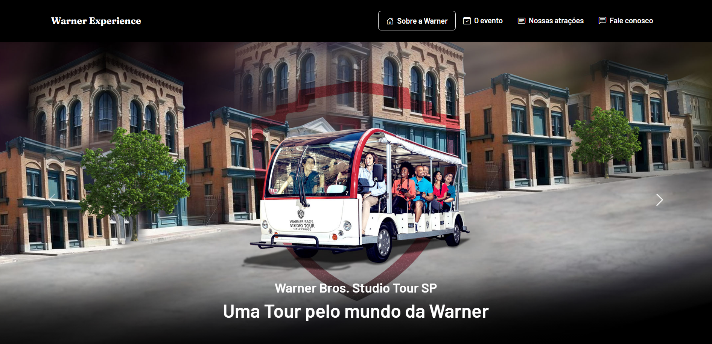

# Warner experience - Vivêncie a experiência dos 100 anos da warner

  

  <a href="#🚀-tecnologias">Tecnologias</a>&nbsp;&nbsp;&nbsp;|&nbsp;&nbsp;&nbsp;
  <a href="#projeto">Projeto</a>&nbsp;&nbsp;&nbsp;|&nbsp;&nbsp;&nbsp;
  <a href="#desafio">Desafio</a>&nbsp;&nbsp;&nbsp;|&nbsp;&nbsp;&nbsp;
  <a href="#o-que-aprendi">O que aprendi</a>

 ## 🚀 Tecnologias

Esse projeto foi desenvolvido com as seguintes tecnologias:

- HTML e CSS
- JavaScript
- JQuery
- JQuery Mask Plugin
- Git e Github

## Projeto

O site Warner Experience é uma página voltada para ser a porta de entrada para os eventos da warner no Brasil.

## Desafio

Como parte de um exercicio para JQuery e Bootstrap, o desenvolvedor deve ser capaz de:

- Desenvolver um site responsivo utilizando Bootstrap.
- implementar componentes do Bootstrap, como o carousel e cards
- Utilizar o plugin do Jquery para fazer a mesacará de um campo no formulário.

Veja o resultado através do <a href="https://warner-tour.vercel.app/">link do Vercel</a>

## O que aprendi

Bootstrap sempre foi um frameowrk voltado para ajudar os desenvolvedores front-end a ter uma layout mais responsivo e a adicionar componentes complexos com poucas classes e atributos, mas eu sempre tive uma certa dificuldade com ele, e este projeto foi de grande auxilio para meu aprendizado

- Layouts responsivos com Bootstrap
- Componentes do framework

